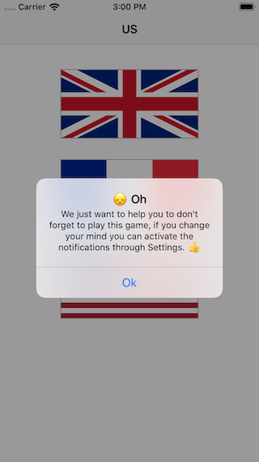

#  Guess The Flag

## Description
This simple game will show you some random flags and ask to choose which one belongs to a particular country.

## Programming To-Do List
- [x] **Add the flags buttons** : On an `ViewController` with `NavigationBar` add three buttons that are going to be the flags.
- [x] **Add the flag assets** : Add the assets for the flags.
- [x] **Add style to the buttons** : Using `CALayer` change the button styles with a border width and color.
- [x] **Pick 3 Random Numbers** : Pick 3 random numbers to use them to pick a flag from the array.
- [x] **Shuffle** : Shuffle up the order of the array, to then pick the first three items.
- [x] **Actions** : Create the actions to let the button interact to choose the correct answer.
- [x] **Show Alert** : Show an alert to let the user know if the answer is correct or not and show the score.

## Demo
### features/design-the-layout
| Screenshot 01 |
| ------------- |
|  |

### features/make-the-basic-game-work
| Screenshot 02 |
| ------------- |
|  |

### features/guess-which-flag
| Screenshot 03 |
| ------------- |
|  |

### features/from-outlets-to-actions
| Screenshot 04 | Screenshot 05 |
| ------------- | ------------- |
|  |  |

### features/userdefaults
| Screenshot 06 |
| ------------- |
|  |

### features/animation-challenge
| Screenshot 07 |
| ------------- |
|  |

### features/challenge-local-notifications
| Screenshot 08 | Screenshot 09 |
| ------------- | ------------- |
|  |  |

| Screenshot 10 | Screenshot 11 |
| ------------- | ------------- |
|  |  |